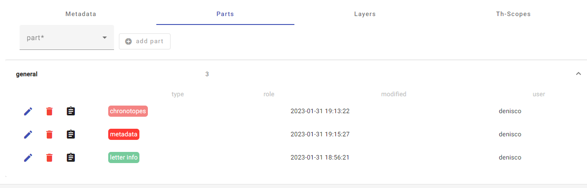
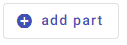

# Creare, modificare, eliminare _parts_
Per creare, modificare, eliminare _parts_, accedere alla schermata riassuntiva selezionando la sezione _parts_ nella schermata superiore della scheda:
>   

Per creare una nuova _part_, selezionare dal menu a tendina del campo _part_ il nome di quella desiderata e cliccare sul comando _add part_.  
>   

Per modificare una parte già salvata, cliccare sul comando _edit_ accanto alla _part_ da modificare e procedere con le modifiche.    
>   

Per eliminare una parte già salvata, cliccare sul comando _delete_ accanto alla parte da eliminare, e confermare cliccando _yes_ nella finestra pop-up.
>   

# Creare, modificare, eliminare elementi
Alcune _parts_ sono costituite da elementi replicabili. Per creare un elemento aprire la _part_ e cliccare sul comando _+ add [nome elemento]_.
>   

Per aggiungere, modificare, eliminare elementi, accedere alla schermata riassuntiva della _part_, che presenta l'elenco degli elementi creati.  
>   

Per modificare un elemento già salvato, cliccare sul comando _edit_ accanto all'elemento da modificare e procedere con le modifiche.  
>   

Per eliminare un elemento già salvato, cliccare sul comando _delete_, e confermare cliccando _yes_ nella finestra pop-up.
>   

Per modificare l'ordine degli elementi nella lista cliccare sui comandi _move up_ e _move down_. 
>   

Ogni volta che un elemento viene creato o modificato, è necessario salvare le modifiche cliccando il comando _accept changes_ in fondo alla schermata.  
>   

Per annullare le modifiche apportate ad un elemento, cliccanre il comando _discard changes_ in fondo alla schermata.  
>   
